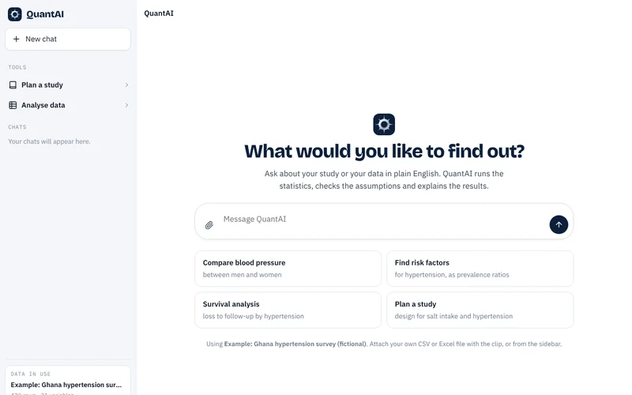
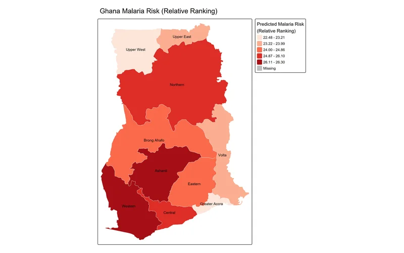
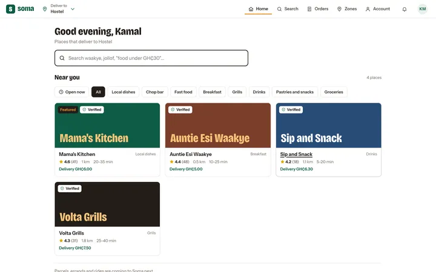

<a href="https://modelanalysishub.com">
  
</a>

<p align="center">
  <a href="https://modelanalysishub.com"></a>
  <a href="https://modelanalysishub.com/ai.html"></a>
  
</p>

The source of **[modelanalysishub.com](https://modelanalysishub.com)**, the studio site of [Amadu Kamal](https://modelanalysishub.com/founder.html). Model Analysis Hub builds statistical and geospatial models, dashboards and web platforms, and makes **QuantAI**, a free research and statistics assistant.

<br>

## QuantAI

<a href="https://modelanalysishub.com/ai.html"></a>

A chat-first statistics tool. You upload a CSV or Excel file and ask in plain English. Every number is computed in the browser by a deterministic engine, and the file never leaves your device.

| Feature | What it does |
|---|---|
| **Reads messy files** | Skips title rows, removes Total rows, reads `GH₵ 1,200` and `45%`, merges `Yes`/`yes`, and finds the right Excel sheet |
| **Checks the data** | Duplicates, `99`/`999` missing codes, impossible values, outliers and wide-format repeats, with one-click fixes |
| **Picks the test by rules** | Shapiro–Wilk, Brown–Forsythe and expected counts choose between t-tests, Welch, ANOVA, Mann–Whitney, Kruskal–Wallis, chi-square and Fisher |
| **Fits models** | Linear, logistic, Poisson, modified Poisson, ordinal, multinomial and mixed models; Kaplan–Meier, log-rank and Cox, all with diagnostics |
| **Reproducible** | Every analysis exports as **Stata, Python, R and SPSS** code that gives the same numbers |
| **Plans studies** | Research question, study design, sample size, test selection and reporting checklists (STROBE, CONSORT, PRISMA…) |

The engine's results are checked against SciPy and statsmodels. An optional assistant, running through a Cloudflare Worker, explains results and runs analyses from chat. It sees a short summary of the data, never the file.

<br>

## Repository layout

```
index.html, projects.html, founder.html   Studio pages
ai.html                                  QuantAI app
assets/js/quantai-engine.js              Statistics engine (tests, models, forecasting)
assets/js/quantai.js                     QuantAI interface and analysis layer (bundled)
assets/css/                              Site and QuantAI styles
cloudflare-worker/worker.js              Assistant endpoint (API key kept as a Worker secret)
```

<br>

## Selected work

<a href="https://modelanalysishub.com/projects.html#malaria-risk"></a>
<a href="https://modelanalysishub.com/projects.html"></a>

Malaria risk mapping for Ghana, Soma (food delivery for the Volta Region), The Sunshine Project NGO website, ProjectFlow and health dashboards. [See all projects →](https://modelanalysishub.com/projects.html)

<br>

## Contact

<a href="https://wa.me/233595586430"></a>
<a href="mailto:amadukamal8@gmail.com"></a>
<a href="https://www.linkedin.com/in/amadu-kamal-65ab5326a"></a>

<sub>© 2026 Model Analysis Hub · Amadu Kamal · Made in Ghana</sub>
